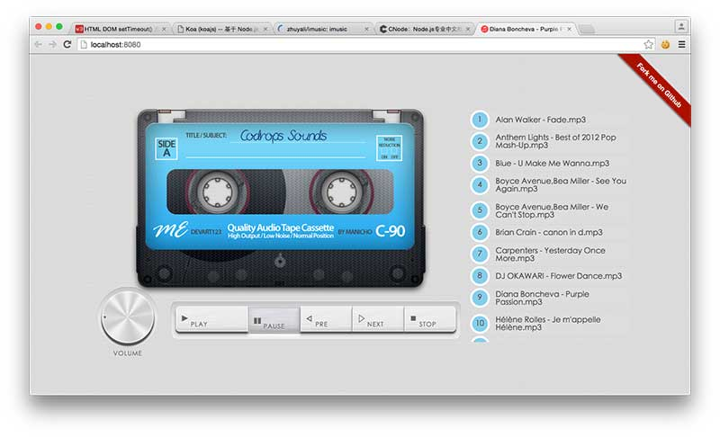

# imusic-react

Music player by react

## Screenshot



## Build Setup

``` bash
# install dependencies
npm install

# serve with hot reload at localhost:8080
npm run dev

# build for production with minification
npm run build
```

## Installation

```shell
$ npm install imusic-react -g
```

## Quick Start

#### 在有音乐的本地目录下，输入命令行:

```shell
$ imusic-react
```

## License

The MIT License
